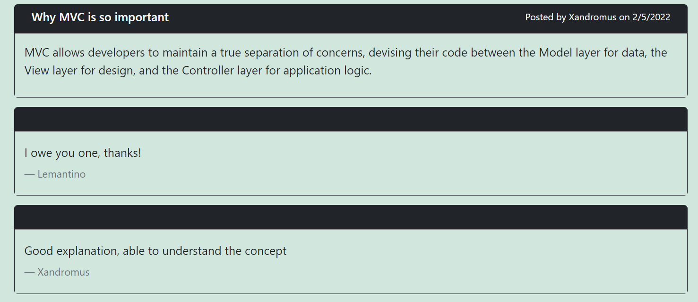
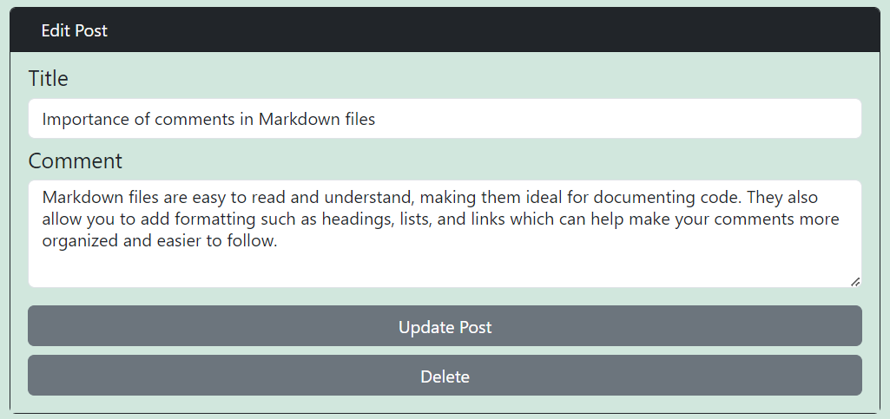

# D14-BloggingCMS

Sitio de blog estilo CMS, para poder publicar artículos, publicaciones de blogs y dar opiniones sobre ellas.

---
  ## Contenido
  1. [Enlaces](#enlaces)
  2. [Tecnologias](#tecnologias)
  3. [Uso](#uso)
  4. [Instalación](#instalación)
  5. [Contribución](#contribución)
  6. [Colaboradores](#colaboradores)
  
---
## Enlaces

**[Aplicación desplegada ](https:// "click")**.

**[URL de repositorio de GitHub](https://github.com/Caro2102/D14-BloggingCMS "click")**.

---
## Tecnologias:

- node JS versión 16.18.0
- npm express 4.17.1
- npm sequelize 6.3.5
- npm mysql2 2.2.5
- npm dotenv 8.2.0
- npm bcrypt 5.0.0
- npm connect-session-sequelize 7.0.4
- npm express-handlebars 5.2.0
- npm express-session 1.17.1
- Boostrap 5
- HTML
- Heroku

---
## Uso
  
* Ingresar a la aplicación desplegada en **[Heroku](https:// "click")** o acceder desde el navegador  con la dirección [http://localhost:3001](http://localhost:3001 ) despues de haber ejecutado el archivo como muestra la sección de [Instalación](#instalación).

* Al ingresar a la aplicación se podran ver las publicaciones existentes en el blog y si se publico alguna después.

    

## Inicio de sesión
* Para ingersar a cualquier en la enlace de navegación o agregar un comentario a una publicación es necesario iniciar sesión o crear una cuenta.

    

    

## Ver o agregar comentarios
* Para ver comentarios de una publicacion, hacer click en la publicacion deseada.

    

    

* Para escribir un comentario y darle submir para agregarlo al final de la lista

    

    

### Ver mis publicaciones
* Dirigirse a "Dashboard" en la barra de navegación.

    

* Se verán las publicaciones que ha creado y la posibilidad de poder agregar más.

    

* Para crear una publicación dar click en botón "New Post" llenar titulo y contenido, después hacer click en "submit" para agregarlo. Aparecerá al final de la lista de tus publicaciones.

    

    

* Seleccionar la publicación que quieras modificar

    

* Cambiar lo que quieras de la publicación y hacer click en el botón de "Update Post"

    
    

* Para eliminar post hacer click en el botón de "Delete"

    
    

---
 ## Instalación
- Clonar repositorio
    - Abrir el siguiente link **[URL de repositorio de GitHub](https://github.com/Caro2102/D14-BloggingCMS "click")**.
    - Hacer click en <> Code.

        
    - Copiar la direccion URL del repositorio.

        
    - Abrir GitBash.
    - Ir a la ubicacion en donde quieres clonar el repositorio.
    - Escribir **`git clone`** y pegar la url antes copiada.
    - Presionar enter para clonar.

- Instalar node desde la pagina oficial **[NodeJS web Oficial](https://nodejs.org/es/ "click")**.
    - Abrir GitBash.
    - Ir a la ubicacion en donde se clonó el repositorio.
    - Escribir **`npm i`** para instalar las dependencias del proyecto.
    - Con esto instalaremos todas las dependecias que tengamos en el package.json y nos creará una carpeta llamada **node_modules** con las dependencias listas para utilizar.
     Dirijirse al archivo **`.env.example`** y agregar las siguientes variables para proteger las credenciales de la base de datos y poder conectarse.
     
            DB_NAME='nombre de la base de datos'
            DB_USER='nombre de usuario'
            DB_PASSWORD='tu contraseña de MYSQL'
        
    - Escribir **`mysql -u root -p`** para conectarse a MySQL CLI e igresar contraseña.
    - Escribir **`source schema.sql`** para crear la base de datos MySQL (Asegurarse que la ruta sea correcta).
        - #### Diagrama UML de la base de datos
            

    - Escribir **`quit`** para desconectarse de MySQL CLI
    - Escribir  en la terminal GitBash **`node seeds/index.js `** para agregar datos a la base de datos y poder comprobar las rutas (opcional).
    - Escribir **`npm start`** para ejecutar el archivo.

---
## Contribución
    
  Para contribuir con este proyecto:
- Fork del repositorio.
- Clonar el  repositorio.
- Actualizar la rama master.

        $git pull -r upstream master
- Crear rama.

        $ git checkout -b feature-nombre-rama
- Realizar cambios, agregarlos, hacer commit y despues hacer push hacia nuestro repositorio indicando la rama que hemos creado.

        $ git push origin feature-nombre-rama
- Hacer un Pull Request.
- Esperar que el codigo se acepte y se haga merge.
